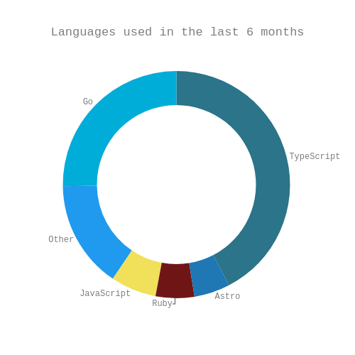

### Hi there 👋

- :shopping: &nbsp; Helping North Americans shop smarter through [Flipp](https://flipp.com/home)
- :seedling: &nbsp; Mentoring the next generation of web developers through [CareerFoundry](https://careerfoundry.com/?utm_campaign=1598884275&utm_term=careerfoundry&utm_source=google&utm_medium=cpc&utm_content=303419907754&hsa_mt=e&hsa_ad=303419907754&hsa_ver=3&hsa_tgt=aud-543084261533:kwd-328979525904&hsa_net=adwords&hsa_grp=60753475632&hsa_src=g&hsa_cam=1598884275&hsa_acc=1437185464&hsa_kw=careerfoundry&gclid=Cj0KCQiA3-yQBhD3ARIsAHuHT64bxHq_KCxTS3qVXH-dA91D6tOmZ80zmgYGNhkqUKUdzpS7nCn8tasaAutMEALw_wcB)
- 🔭 &nbsp; A few of my prior contributions:

| Project                                                                      | Description                                            |
| ---------------------------------------------------------------------------- | ------------------------------------------------------ |
| [Moonfare](https://www.moonfare.com/)                                        | An investment platform for private equity              |
| [Diginex Access](https://learn.eqonex.com/news/understanding-diginex-access) | A cryptocurrency data aggregation and trading platform |
| [ReloTalent Salary Calculator](https://www.relotalent.com/salary-calculator) | An expat compensation and tax calculation engine       |

- :books: &nbsp; I strive for continuous learning

  - [Reading list](https://github.com/users/mtanzim/projects/9)
  - [Online courses](https://github.com/users/mtanzim/projects/4)
  - [Side projects](https://github.com/users/mtanzim/projects/5)

- :paintbrush: &nbsp; What I'm reading and writing in these days:

<!-- START_WAKA -->

<!-- END_WAKA -->

- ⚡&nbsp; Fun facts:
  - I enjoy travel and photography &nbsp; :camera: &nbsp; [Instagram](https://www.instagram.com/tanzim_m/?hl=en)
  - I was on a [podcast](https://open.spotify.com/episode/5u3gXFNGomUkKimQHE9sgG?si=Op9ZjqG-RcuyWr9Uek2TvA) discussing self studying software engineering, staying productive during long term travel, and the tech startup scene in Berlin
- 📫 &nbsp; How to reach me: [LinkedIn](https://www.linkedin.com/in/tanzim-mokammel), [Email](mailto:mtanzim@gmail.com)
