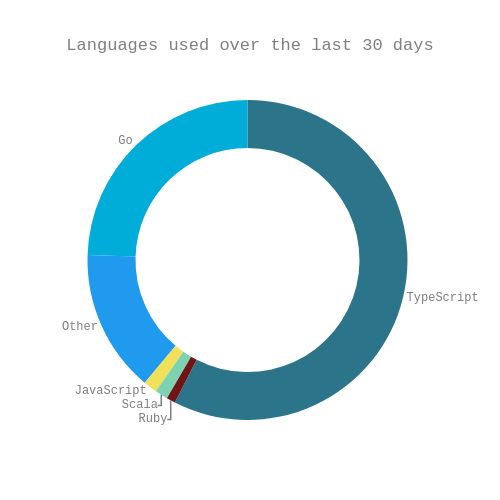

### Hi there 👋

- :shopping: &nbsp; Helping North Americans shop smarter through [Flipp](https://flipp.com/home)
- 🔭 &nbsp; A few of my prior contributions:

| Project                                                                      | Description                                            |
| ---------------------------------------------------------------------------- | ------------------------------------------------------ |
| [Moonfare](https://www.moonfare.com/)                                        | An investment platform for private equity              |
| [Diginex Access](https://www.diginex.com/diginex-access/)                    | A cryptocurrency data aggregation and trading platform |
| [ReloTalent Salary Calculator](https://www.relotalent.com/salary-calculator) | An expat compensation and tax calculation engine       |

- :books: &nbsp; I strive for continuous learning: see my [self study plan](https://github.com/users/mtanzim/projects/4◊) and [ongoing side projects](https://github.com/users/mtanzim/projects/5)

- :paintbrush: &nbsp; What I'm reading and writing in these days:

<!-- START_WAKA -->

<!-- END_WAKA -->

- ⚡&nbsp; Fun facts:
  - I am currently learning chess &nbsp; :chess_pawn:
  - I enjoy travel and photography &nbsp; :camera: &nbsp; [Instagram](https://www.instagram.com/tanzim_m/?hl=en)
  - I was on a [podcast](https://open.spotify.com/episode/5u3gXFNGomUkKimQHE9sgG?si=Op9ZjqG-RcuyWr9Uek2TvA) discussing self studying software engineering, staying productive during long term travel, and the tech startup scene in Berlin
- 📫 &nbsp; How to reach me: [LinkedIn](https://www.linkedin.com/in/tanzim-mokammel), [Email](mailto:mtanzim@gmail.com)
