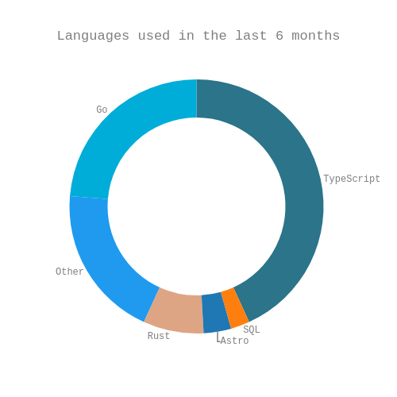

### Hi there 👋

- 🧠 🤖 Currently, I'm [contributing](https://github.com/tanzimcohere) to [Cohere](https://cohere.com/): empowering developers and enterprise customers with AI
- 🔭 &nbsp; A few of my prior contributions:

| Project                                                                      | Description                                            |
| ---------------------------------------------------------------------------- | ------------------------------------------------------ |
| [Flipp](https://flipp.com/home)                                | Built an interactive design tool for digital flyers to help North Americans shop smarter and save on essential goods        |
| [CareerFoundry](https://careerfoundry.com/)                                  | Mentored the next generation of web developers        |
| [Moonfare](https://www.moonfare.com/)                                        | An investment platform for private equity              |
| [Diginex Access](https://learn.eqonex.com/news/understanding-diginex-access) | A cryptocurrency data aggregation and trading platform |
| [ReloTalent Salary Calculator](https://www.relotalent.com/salary-calculator) | An expat compensation and tax calculation engine       |

- :briefcase: See additional deltails on my [resume](https://mtanzim.com/work/resume.pdf)

- :books: &nbsp; I strive for continuous learning

  - [Reading list](https://github.com/users/mtanzim/projects/9)
  - [Online courses](https://github.com/users/mtanzim/projects/4)
  - [Side projects](https://github.com/users/mtanzim/projects/5)

- :paintbrush: &nbsp; What I'm reading and writing in these days:

<!-- START_WAKA -->

<!-- END_WAKA -->

- ⚡&nbsp; Fun facts:
  - I enjoy travel and [photography](https://mtanzim.com/play/photography/2023/)
  - I was on a [podcast](https://open.spotify.com/episode/5u3gXFNGomUkKimQHE9sgG?si=Op9ZjqG-RcuyWr9Uek2TvA) discussing self studying software engineering, staying productive during long term travel, and the tech startup scene in Berlin
- 📫 &nbsp; How to reach me: [LinkedIn](https://www.linkedin.com/in/tanzim-mokammel), [Email](mailto:mtanzim@gmail.com)
